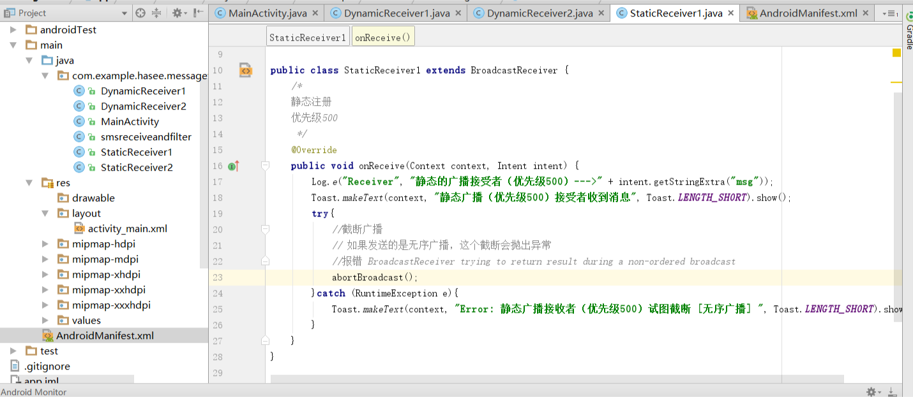
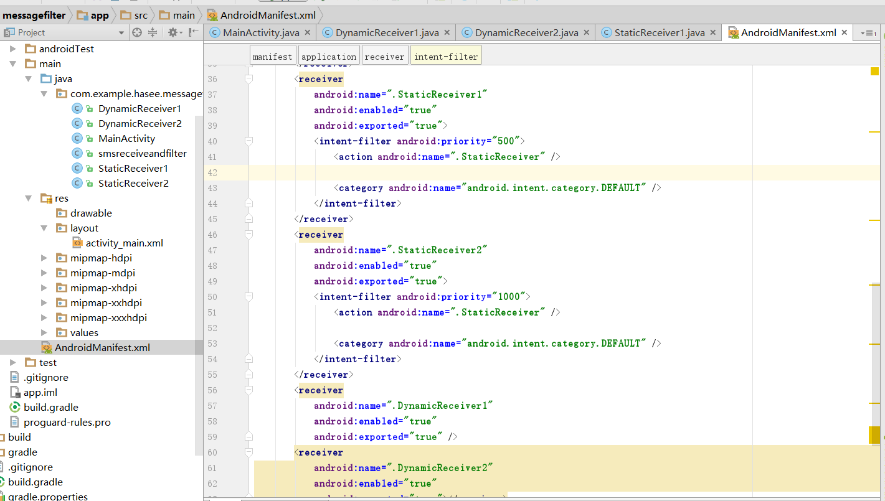

2019.11.14

# 问题

今天做实验时写了两个类继承自广播类，注册静态广播，但是却怎么也收不到静态广播消息





# 解决

```java
Android 8.0 以前，对于静态注册的广播接收器，发送自定义广播时只需构造Intent并设置action，然后调用sendBroadcast（intent）即可发送；而在Android 8.0 之后，参照官方文档，对于静态注册的广播接收器的管理更为严格，以上代码已不再适用，还需添加如下代码才能实现。（Android 8.0官方文档在文末给出）

intent.setComponent(new ComponentName("pkg","cls"));
```


其中pkg为项目包名，cls为静态注册的广播接收器的完整路径。例如：

```java
intent.setComponent(new ComponentName("com.example.broadcasttest","com.example.broadcasttest.MyBroadcastReceiver"));
```


```java
也就是说Android 8.0 之后发送自定义广播更加“精确”，需要精确指定接收器的路径才能发送成功。
```

# 总结

**在Android 8.0 之后想要令多个静态注册的接收器接收这一自定义广播很难办到，因为pkg和cls都已经给定了，除非再构造一个Intent出来，然后重复上述过程，发送两个广播。那么若有一需求要求向很多程序发送该广播，那么该方法就很不实际了。** 

