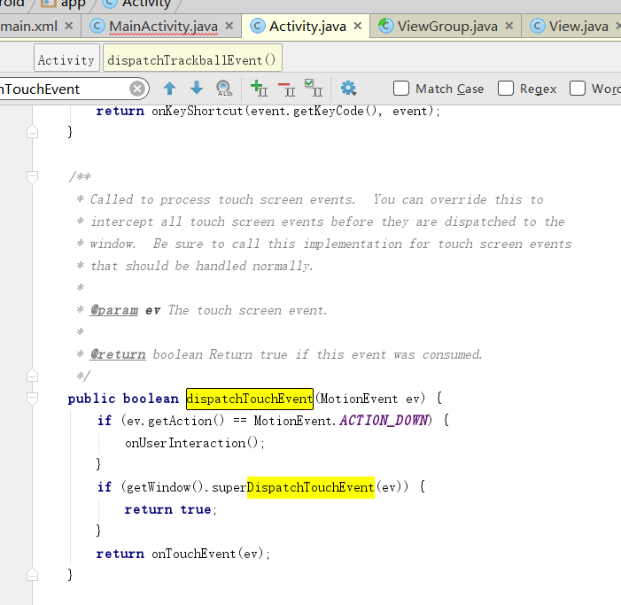
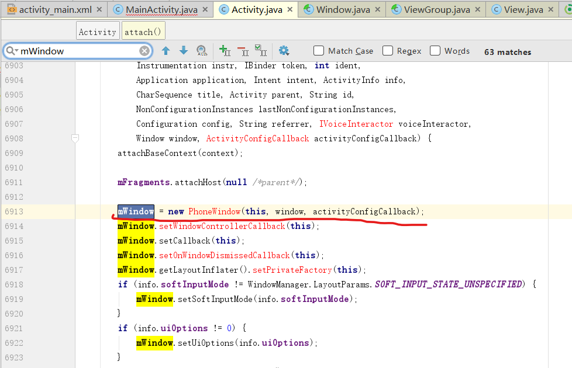
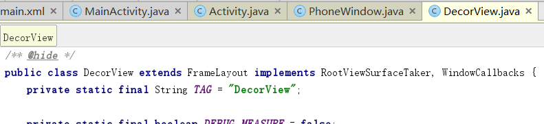

# activity中传递解析

当我们手指点击手机屏幕的时候，首先会触发activty的dispatchTouchEvent，源码如下： 



跟进getWindow()

```java
public Window getWindow() {    
    return mWindow;
}
```

```java
private Window mWindow;
```

发现返回的时Window对象

查看Window对象:

```java
public abstract class Window {    
    /** Flag for the "options panel" feature.  This is enabled by default. */
    public static final int FEATURE_OPTIONS_PANEL = 0;
    /** Flag for the "no title" feature, turning off the title at the top     *  of the screen. */  
    public static final int FEATURE_NO_TITLE = 1;
    ...
   	...
}
```

发现这是一个抽象类, 所以在Activity中搜索window对象的具体创建部分的代码:



 很明显,PhoneWindow就是他的具体实现类，所以我们继续跟踪到PhoneWindow的superDispatchTouchEvent源码： 

```java
@Override
public boolean superDispatchTouchEvent(MotionEvent event) {    
    return mDecor.superDispatchTouchEvent(event);
}
```

来康一下这个mDecor是个啥:

```java
// This is the top-level view of the window, containing the window decor.
private DecorView mDecor;
```



这个view就是activity的顶级view，通过getWindow().getDecorView()可以获取到mDecor对象，他继承FrameLayout，并且我们经常在activity里面通过setContentView加入的view其实就是mDecor的子view。到这里，点击事件已经从activity传到View当中了，接下来要分析的就是顶级View把事件如何分发到各个子view中了。
继续了解mDecor.superDispatchTouchEvent(event)的具体实现：

```java
public boolean superDispatchTouchEvent(MotionEvent event) {    
	return super.dispatchTouchEvent(event);
}
```

看一下Decor的父类 也就是FrameLayout:

```java
@RemoteView
public class FrameLayout extends ViewGroup {    
    private static final int DEFAULT_CHILD_GRAVITY = Gravity.TOP | Gravity.START;
    ....
}
```

  mDecor继承FrameLayout，所以他的super肯定是ViewGroup，super.dispatchTouchEvent(event)则调用 ViewGroup的dispatchTouchEvent方法，到此点击事件就传递到ViewGroup中。 

 继续查看ViewGroup的dispatchTouchEvent方法的源码： 

```java
@Override
public boolean dispatchTouchEvent(MotionEvent ev) {
    if (mInputEventConsistencyVerifier != null) {
        mInputEventConsistencyVerifier.onTouchEvent(ev, 1);
    }

    // If the event targets the accessibility focused view and this is it, start
    // normal event dispatch. Maybe a descendant is what will handle the click.
    if (ev.isTargetAccessibilityFocus() && isAccessibilityFocusedViewOrHost()) {
        ev.setTargetAccessibilityFocus(false);
    }

    boolean handled = false;
    if (onFilterTouchEventForSecurity(ev)) {
        final int action = ev.getAction();
        final int actionMasked = action & MotionEvent.ACTION_MASK;

        // Handle an initial down.
        if (actionMasked == MotionEvent.ACTION_DOWN) {
            // Throw away all previous state when starting a new touch gesture.
            // The framework may have dropped the up or cancel event for the previous gesture
            // due to an app switch, ANR, or some other state change.
            cancelAndClearTouchTargets(ev);
            resetTouchState();
        }

        // Check for interception.
        final boolean intercepted;
        if (actionMasked == MotionEvent.ACTION_DOWN
            || mFirstTouchTarget != null) {
            final boolean disallowIntercept = (mGroupFlags & FLAG_DISALLOW_INTERCEPT) != 0;
            if (!disallowIntercept) {
                intercepted = onInterceptTouchEvent(ev);
                ev.setAction(action); // restore action in case it was changed
            } else {
                intercepted = false;
            }
        } else {
            // There are no touch targets and this action is not an initial down
            // so this view group continues to intercept touches.
            intercepted = true;
        }

        // If intercepted, start normal event dispatch. Also if there is already
        // a view that is handling the gesture, do normal event dispatch.
        if (intercepted || mFirstTouchTarget != null) {
            ev.setTargetAccessibilityFocus(false);
        }

        // Check for cancelation.
        final boolean canceled = resetCancelNextUpFlag(this)
            || actionMasked == MotionEvent.ACTION_CANCEL;

        // Update list of touch targets for pointer down, if needed.
        final boolean split = (mGroupFlags & FLAG_SPLIT_MOTION_EVENTS) != 0;
        TouchTarget newTouchTarget = null;
        boolean alreadyDispatchedToNewTouchTarget = false;
        if (!canceled && !intercepted) {

            // If the event is targeting accessiiblity focus we give it to the
            // view that has accessibility focus and if it does not handle it
            // we clear the flag and dispatch the event to all children as usual.
            // We are looking up the accessibility focused host to avoid keeping
            // state since these events are very rare.
            View childWithAccessibilityFocus = ev.isTargetAccessibilityFocus()
                ? findChildWithAccessibilityFocus() : null;

            if (actionMasked == MotionEvent.ACTION_DOWN
                || (split && actionMasked == MotionEvent.ACTION_POINTER_DOWN)
                || actionMasked == MotionEvent.ACTION_HOVER_MOVE) {
                final int actionIndex = ev.getActionIndex(); // always 0 for down
                final int idBitsToAssign = split ? 1 << ev.getPointerId(actionIndex)
                    : TouchTarget.ALL_POINTER_IDS;

                // Clean up earlier touch targets for this pointer id in case they
                // have become out of sync.
                removePointersFromTouchTargets(idBitsToAssign);

                final int childrenCount = mChildrenCount;
                if (newTouchTarget == null && childrenCount != 0) {
                    final float x = ev.getX(actionIndex);
                    final float y = ev.getY(actionIndex);
                    // Find a child that can receive the event.
                    // Scan children from front to back.
                    final ArrayList<View> preorderedList = buildTouchDispatchChildList();
                    final boolean customOrder = preorderedList == null
                        && isChildrenDrawingOrderEnabled();
                    final View[] children = mChildren;
                    for (int i = childrenCount - 1; i >= 0; i--) {
                        final int childIndex = getAndVerifyPreorderedIndex(
                            childrenCount, i, customOrder);
                        final View child = getAndVerifyPreorderedView(
                            preorderedList, children, childIndex);

                        // If there is a view that has accessibility focus we want it
                        // to get the event first and if not handled we will perform a
                        // normal dispatch. We may do a double iteration but this is
                        // safer given the timeframe.
                        if (childWithAccessibilityFocus != null) {
                            if (childWithAccessibilityFocus != child) {
                                continue;
                            }
                            childWithAccessibilityFocus = null;
                            i = childrenCount - 1;
                        }

                        if (!canViewReceivePointerEvents(child)
                            || !isTransformedTouchPointInView(x, y, child, null)) {
                            ev.setTargetAccessibilityFocus(false);
                            continue;
                        }

                        newTouchTarget = getTouchTarget(child);
                        if (newTouchTarget != null) {
                            // Child is already receiving touch within its bounds.
                            // Give it the new pointer in addition to the ones it is handling.
                            newTouchTarget.pointerIdBits |= idBitsToAssign;
                            break;
                        }

                        resetCancelNextUpFlag(child);
                        if (dispatchTransformedTouchEvent(ev, false, child, idBitsToAssign)) {
                            // Child wants to receive touch within its bounds.
                            mLastTouchDownTime = ev.getDownTime();
                            if (preorderedList != null) {
                                // childIndex points into presorted list, find original index
                                for (int j = 0; j < childrenCount; j++) {
                                    if (children[childIndex] == mChildren[j]) {
                                        mLastTouchDownIndex = j;
                                        break;
                                    }
                                }
                            } else {
                                mLastTouchDownIndex = childIndex;
                            }
                            mLastTouchDownX = ev.getX();
                            mLastTouchDownY = ev.getY();
                            newTouchTarget = addTouchTarget(child, idBitsToAssign);
                            alreadyDispatchedToNewTouchTarget = true;
                            break;
                        }

                        // The accessibility focus didn't handle the event, so clear
                        // the flag and do a normal dispatch to all children.
                        ev.setTargetAccessibilityFocus(false);
                    }
                    if (preorderedList != null) preorderedList.clear();
                }

                if (newTouchTarget == null && mFirstTouchTarget != null) {
                    // Did not find a child to receive the event.
                    // Assign the pointer to the least recently added target.
                    newTouchTarget = mFirstTouchTarget;
                    while (newTouchTarget.next != null) {
                        newTouchTarget = newTouchTarget.next;
                    }
                    newTouchTarget.pointerIdBits |= idBitsToAssign;
                }
            }
        }

        // Dispatch to touch targets.
        if (mFirstTouchTarget == null) {
            // No touch targets so treat this as an ordinary view.
            handled = dispatchTransformedTouchEvent(ev, canceled, null,
                                                    TouchTarget.ALL_POINTER_IDS);
        } else {
            // Dispatch to touch targets, excluding the new touch target if we already
            // dispatched to it.  Cancel touch targets if necessary.
            TouchTarget predecessor = null;
            TouchTarget target = mFirstTouchTarget;
            while (target != null) {
                final TouchTarget next = target.next;
                if (alreadyDispatchedToNewTouchTarget && target == newTouchTarget) {
                    handled = true;
                } else {
                    final boolean cancelChild = resetCancelNextUpFlag(target.child)
                        || intercepted;
                    if (dispatchTransformedTouchEvent(ev, cancelChild,
                                                      target.child, target.pointerIdBits)) {
                        handled = true;
                    }
                    if (cancelChild) {
                        if (predecessor == null) {
                            mFirstTouchTarget = next;
                        } else {
                            predecessor.next = next;
                        }
                        target.recycle();
                        target = next;
                        continue;
                    }
                }
                predecessor = target;
                target = next;
            }
        }

        // Update list of touch targets for pointer up or cancel, if needed.
        if (canceled
            || actionMasked == MotionEvent.ACTION_UP
            || actionMasked == MotionEvent.ACTION_HOVER_MOVE) {
            resetTouchState();
        } else if (split && actionMasked == MotionEvent.ACTION_POINTER_UP) {
            final int actionIndex = ev.getActionIndex();
            final int idBitsToRemove = 1 << ev.getPointerId(actionIndex);
            removePointersFromTouchTargets(idBitsToRemove);
        }
    }

    if (!handled && mInputEventConsistencyVerifier != null) {
        mInputEventConsistencyVerifier.onUnhandledEvent(ev, 1);
    }
    return handled;
}
```

  **看第19-25行** 当点击事件是MotionEvent.ACTION_DOWN时，及手指刚刚触碰屏幕第一个触发的事件，里面调用了两个方法，cancelAndClearTouchTargets(ev)和resetTouchState();
```java
    /**
     * Cancels and clears all touch targets.
     */
    private void cancelAndClearTouchTargets(MotionEvent event) {
        if (mFirstTouchTarget != null) {
            boolean syntheticEvent = false;
            if (event == null) {
                final long now = SystemClock.uptimeMillis();
                event = MotionEvent.obtain(now, now,
                        MotionEvent.ACTION_CANCEL, 0.0f, 0.0f, 0);
                event.setSource(InputDevice.SOURCE_TOUCHSCREEN);
                syntheticEvent = true;
            }

            for (TouchTarget target = mFirstTouchTarget; target != null; target = target.next) {
                resetCancelNextUpFlag(target.child);
                dispatchTransformedTouchEvent(event, true, target.child, target.pointerIdBits);
            }
            clearTouchTargets();

            if (syntheticEvent) {
                event.recycle();
            }
        }
    }
```
```java
/**
     * 重置所有状态准备新的循环
     */
    private void resetTouchState() {
        clearTouchTargets();
        resetCancelNextUpFlag(this);
        mGroupFlags &= ~FLAG_DISALLOW_INTERCEPT;	// FLAG_DISALLOW_INTERCEPT 用来阻止父类拦截点击事件
        mNestedScrollAxes = SCROLL_AXIS_NONE;
    }
```

 **29-44行** 发现有判断父类**是否拦截事件**的处理代码:

一般两种情况下肯定会调用onInterceptTouchEvent方法：

1.点击事件为MotionEvent.ACTION_DOWN。

2.mFirstTouchTarget ！=null及子类处理点了击事件，因为mFirstTouchTarget 是在dispatchTransformedTouchEvent返回true的时候赋值的

反过来，点击事件MotionEvent.ACTION_DOWN被ViewGroup拦截，及mFirstTouchTarget =null，则后面move，up事件将不在调用onInterceptTouchEvent方法，因为mFirstTouchTarget =null，直接跳过if语句执行下面的else语句。

```java
final boolean disallowIntercept = (mGroupFlags & FLAG_DISALLOW_INTERCEPT) != 0;//这个标志位通过requestDisallowInterceptTouchEvent(boolean disallowIntercept)可以控制

```

 **61-169行** 如果没有被拦截也没有被取消:

```java
if (!canceled && !intercepted) {

   //如果事件的目标是accessiiblity焦点，那么我们会将其提供给具有易访问性焦点的视图，如果它不处理它的话
    //我们象往常一样把活动通知给所有的child。
    //我们正在查找可访问性集中的主机，以避免保持状态，因为这些事件非常罕见。
    View childWithAccessibilityFocus = ev.isTargetAccessibilityFocus()
        ? findChildWithAccessibilityFocus() : null;

    if (actionMasked == MotionEvent.ACTION_DOWN
        || (split && actionMasked == MotionEvent.ACTION_POINTER_DOWN)
        || actionMasked == MotionEvent.ACTION_HOVER_MOVE) {
        final int actionIndex = ev.getActionIndex(); // always 0 for down
        final int idBitsToAssign = split ? 1 << ev.getPointerId(actionIndex)
            : TouchTarget.ALL_POINTER_IDS;

        // 清理这个指针id的早期触摸目标，以防它们不同步。
        removePointersFromTouchTargets(idBitsToAssign);

        final int childrenCount = mChildrenCount;
        if (newTouchTarget == null && childrenCount != 0) {
            final float x = ev.getX(actionIndex);
            final float y = ev.getY(actionIndex);
            // Find a child that can receive the event.
            // Scan children from front to back.
            final ArrayList<View> preorderedList = buildTouchDispatchChildList();
            final boolean customOrder = preorderedList == null
                && isChildrenDrawingOrderEnabled();
            final View[] children = mChildren;
            for (int i = childrenCount - 1; i >= 0; i--) {
                final int childIndex = getAndVerifyPreorderedIndex(
                    childrenCount, i, customOrder);
                final View child = getAndVerifyPreorderedView(
                    preorderedList, children, childIndex);

                // 如果有一个具有可访问性焦点的视图，我们希望它首先获得事件，如果不处理，我们将执行正常的分派。我们可以进行两次迭代，但是考虑到时间范围，这样做更安全。
                if (childWithAccessibilityFocus != null) {
                    if (childWithAccessibilityFocus != child) {
                        continue;
                    }
                    childWithAccessibilityFocus = null;
                    i = childrenCount - 1;
                }

                if (!canViewReceivePointerEvents(child)
                    || !isTransformedTouchPointInView(x, y, child, null)) {
                    ev.setTargetAccessibilityFocus(false);
                    continue;
                }

                newTouchTarget = getTouchTarget(child);
                if (newTouchTarget != null) {
                    // Child is already receiving touch within its bounds.
                    // Give it the new pointer in addition to the ones it is handling.
                    newTouchTarget.pointerIdBits |= idBitsToAssign;
                    break;
                }

                resetCancelNextUpFlag(child);
                if (dispatchTransformedTouchEvent(ev, false, child, idBitsToAssign)) {
                    // Child wants to receive touch within its bounds.
                    mLastTouchDownTime = ev.getDownTime();
                    if (preorderedList != null) {
                        // childIndex points into presorted list, find original index
                        for (int j = 0; j < childrenCount; j++) {
                            if (children[childIndex] == mChildren[j]) {
                                mLastTouchDownIndex = j;
                                break;
                            }
                        }
                    } else {
                        mLastTouchDownIndex = childIndex;
                    }
                    mLastTouchDownX = ev.getX();
                    mLastTouchDownY = ev.getY();
                    newTouchTarget = addTouchTarget(child, idBitsToAssign);
                    alreadyDispatchedToNewTouchTarget = true;
                    break;
                }

                // The accessibility focus didn't handle the event, so clear
                // the flag and do a normal dispatch to all children.
                ev.setTargetAccessibilityFocus(false);
            }
            if (preorderedList != null) preorderedList.clear();
        }

        if (newTouchTarget == null && mFirstTouchTarget != null) {
            // 没有找到child来接收事件。
            // 将指针分配给最近添加的最少的目标
            newTouchTarget = mFirstTouchTarget;
            while (newTouchTarget.next != null) {
                newTouchTarget = newTouchTarget.next;
            }
            newTouchTarget.pointerIdBits |= idBitsToAssign;
        }
    }
}
```

 **172-210行，事件传递到子View** if (mFirstTouchTarget == null)如果条件成立，则说明mFirstTouchTarget 为空，没有被赋值，因为mFirstTouchTarget 是在第146行被赋值，根据分析不执行这行代码的逻辑如下：dispatchTransformedTouchEvent返回false或者点击事件被拦截。总之，就是事件没有被子View处理。这个时候，就入到if语句中，发现就一个方法，如下：

```java
// Dispatch to touch targets.
if (mFirstTouchTarget == null) {    
    //没有接触的目标，所以把这当作一个普通 view.    
    handled = dispatchTransformedTouchEvent(ev, canceled, null,            			TouchTarget.ALL_POINTER_IDS);
}
```

 继续看下dispatchTransformedTouchEvent(ev, canceled, null,
 TouchTarget.ALL_POINTER_IDS);方法的源码 

```java
    /**
     * 将运动事件转换为特定子视图的坐标空间
     * 过滤掉不相关的指针id，并在必要时覆盖其操作。
     * 如果child为null，则假设MotionEvent将被发送到这个ViewGroup。
     */
    private boolean dispatchTransformedTouchEvent(MotionEvent event, boolean cancel,
            View child, int desiredPointerIdBits) {
        final boolean handled;

        // 取消运动是一种特殊情况。我们不需要执行任何转换
        // 或过滤。重要的是行动，而不是内容。
        final int oldAction = event.getAction();
        if (cancel || oldAction == MotionEvent.ACTION_CANCEL) {
            event.setAction(MotionEvent.ACTION_CANCEL);
            if (child == null) {
                handled = super.dispatchTouchEvent(event);
            } else {
                handled = child.dispatchTouchEvent(event);
            }
            event.setAction(oldAction);
            return handled;
        }

        // 计算要传递的指针的数量。
        final int oldPointerIdBits = event.getPointerIdBits();
        final int newPointerIdBits = oldPointerIdBits & desiredPointerIdBits;

        // 如果由于某种原因，我们最终处于一种不一致的状态
		//可能会产生一个没有指针的动作事件，然后删除该事件。
        if (newPointerIdBits == 0) {
            return false;
        }

        // 如果指针的数量相同，并且我们不需要执行任何复杂的不可逆转换，那么我们可以为这个分派重用motion事件，只要我们小心地还原我们所做的任何更改。否则我们需要复印一份。
        final MotionEvent transformedEvent;
        if (newPointerIdBits == oldPointerIdBits) {
            if (child == null || child.hasIdentityMatrix()) {
                if (child == null) {
                    handled = super.dispatchTouchEvent(event);
                } else {
                    final float offsetX = mScrollX - child.mLeft;
                    final float offsetY = mScrollY - child.mTop;
                    event.offsetLocation(offsetX, offsetY);

                    handled = child.dispatchTouchEvent(event);

                    event.offsetLocation(-offsetX, -offsetY);
                }
                return handled;
            }
            transformedEvent = MotionEvent.obtain(event);
        } else {
            transformedEvent = event.split(newPointerIdBits);
        }

        // 执行任何必要的转换和分派。
        if (child == null) {
            handled = super.dispatchTouchEvent(transformedEvent);
        } else {
            final float offsetX = mScrollX - child.mLeft;
            final float offsetY = mScrollY - child.mTop;
            transformedEvent.offsetLocation(offsetX, offsetY);
            if (! child.hasIdentityMatrix()) {
                transformedEvent.transform(child.getInverseMatrix());
            }

            handled = child.dispatchTouchEvent(transformedEvent);
        }

        // Done.
        transformedEvent.recycle();
        return handled;
    }
```


1.android的事件传递是先传递到父类，再到子类的。
2.ViewGroup中可以通过onInterceptTouchEvent方法对事件传递进行拦截，但是**子View可以通过requestDisallowInterceptTouchEvent(boolean disallowIntercept)控制父类的拦截事件是否调用**。
3.子View消耗掉点击事件后，父类onTouchEvent方法不会调用，子View不消耗点击事件，会传到父类onTouchEvent方法，父类onTouchEvent方法返回false，则最终传递到activity的onTouchEvent方法。
4.ViewGroup一旦调用onInterceptTouchEvent方法拦截点击事件后，本次点击序列事件则都交于该ViewGroup处理，并且onInterceptTouchEvent将不再执行( 见 2.mFirstTouchTarget ！=null及子类...)

5.当dispatchTouchEvent在进行事件分发的时候，只有前一个action返回true，才会触发下一个action.也就是说，子view 未消耗点击事件，及dispatchTouchEvent返回false，这样mFirstTouchTarget =null,则后续action直接由ViewGroup执行，不传递给子View