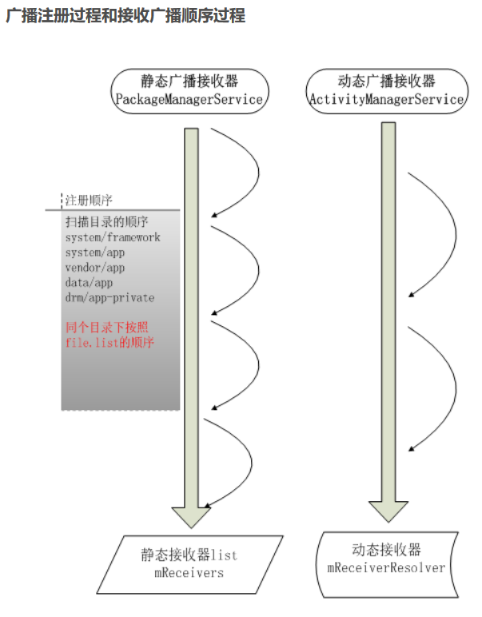

# 特殊广播
- **特殊的广播：**指那些操作比较频繁的广播事件类型。如：屏幕的开、关广播，电量的变化广播等等
- 这种特殊的广播事件在 AndroidManifest.xml 中注册是**无效的**！
   因为这种特殊的广播如果在清单文件中注册，会浪费内存资源。你可以想象下，如果有100个应用在清单文件中注册了手机电量变化广播接收者，那当手机电量发生变化时，这100个应用的广播接收者就有可能都运行...那会造成什么结果...。所以：只能动态注册（在代码中注册）

# 有序广播
当广播为有序广播时
- 优先级高的先接收
- 同优先级的广播接收器，动态优先于静态
- 同优先级的同类广播接收器:
	+ 静态：先扫描（安装）的优先于后扫描的
	+ 动态：先注册的优先于后注册的


# 无序广播
如果广播是无序的，那么所有的registeredReceivers都会一次性被处理，因为所有的动态注册[^动态注册流程] 的广播，他们的进程都是活着的，直接让他们去处理就好了。但是这一条对于静态注册的广播不适用。这是因为静态注册[^静态注册流程] 的广播，我们无法知道他到底进程是否存活，而如果都不是活着的，需要先把进程拉起来，一次性拉起很多进程，这是性能上无法忍受的。所以静态注册的广播，不能像动态注册的广播那样一次性执行。发送无须广播时候，静态注册的Recevier的执行是这样的，按照receivers队列，依次检查队列里面的Receiver是否存活，如果是活着的，则执行该Recevierd的OnReceiver回调，如果进程尚不存在，则首先创建进程，然后执行BroadcastReceiver的OnRecevier 回调，当一个BroadcastReceiver执行完，再去执行receivers队列里的下一个BroadcastReceiver。而receivers队列是按照优先级排列的。
那么对于无序广播来说，BroadcastReceiver的执行顺序就明确了：

1. 优先级不同或广播类型不同时:
	- 无视优先级，动态广播接收器优先于静态广播接收器,所有的动态注册的BroadcastRecevier，会被一起执行，他们执行的顺序是不固定的，由Android的进程调度决定。
	
	- 当动态注册的BroadcastRecevier被执行完以后，会按照优先级，依次执行静态注册的BroadcastReceiver。
2. 同优先级的同类广播接收器:
	- 静态：先扫描（安装）的优先于后扫描的
	- 动态：先注册的优先于后注册的。

[^静态注册流程]: 静态接收，就是配置到manifest.xml文件中，PackageManagerService扫描后记录其信息……

**静态receiver的注册是由PackageManagerService开机的时候负责初始化**

**（PackageManagerService之后简称为PMS）**

PMS在开机的时候会对系统一些目录逐个扫描，解析apk文件。静态广播接收器就是在PMS做这件事情的时候顺便处理的。

PMS会解析apk的manifest文件，查找这里注册的receiver，然后加载到内存中

下面看一下PMS是如何工作的:




[参考链接](https://blog.csdn.net/edmond999/article/details/45817343)

[参考链接](https://www.iteye.com/blog/su1216-1776121)

[^动态注册流程]: 动态接收，就是从代码中注册，通过调用下面的方法实现


```java
private final int broadcastIntentLocked(ProcessRecord callerApp,   
        String callerPackage, Intent intent, String resolvedType,   
        IIntentReceiver resultTo, int resultCode, String resultData,   
        Bundle map, String requiredPermission,   
        boolean ordered, boolean sticky, int callingPid, int callingUid) {   

    …………
    …………

    // 静态广播接收器list
    List receivers = null; 

    // 动态广播接收器List
    List<BroadcastFilter> registeredReceivers = null;   

    // 获取静态广播接收器mReceivers
    try {   
        if (intent.getComponent() != null) {   
            // Broadcast is going to one specific receiver class...   
            ActivityInfo ai = AppGlobals.getPackageManager().   
                getReceiverInfo(intent.getComponent(), STOCK_PM_FLAGS);   
            if (ai != null) {   
                receivers = new ArrayList();   
                ResolveInfo ri = new ResolveInfo();   
                ri.activityInfo = ai;
                receivers.add(ri);   
            }   
        } else {   
            // Need to resolve the intent to interested receivers...   
            if ((intent.getFlags()&Intent.FLAG_RECEIVER_REGISTERED_ONLY)   
                     == 0) {   
                receivers =   
                    AppGlobals.getPackageManager().queryIntentReceivers(   
                            intent, resolvedType, STOCK_PM_FLAGS);   
            } 
            // 获取动态广播接收器mReceiverResolver
            registeredReceivers = mReceiverResolver.queryIntent(intent, resolvedType, false);   
        }   
    } catch (RemoteException ex) {   
        // pm is in same process, this will never happen.   
    }   

    final boolean replacePending =   
            (intent.getFlags()&Intent.FLAG_RECEIVER_REPLACE_PENDING) != 0;   

    int NR = registeredReceivers != null ? registeredReceivers.size() : 0;  
    ……
    // 如果接收到的广播 是普通广播。
    if (!ordered && NR > 0) {   
        // If we are not serializing this broadcast, then send the   
        // registered receivers separately so they don't wait for the   
        // components to be launched.   
        BroadcastRecord r = new BroadcastRecord(intent, callerApp,   
                callerPackage, callingPid, callingUid, requiredPermission,   
                registeredReceivers, resultTo, resultCode, resultData, map,   
                ordered, sticky, false);   

    // 很明显接收到普通广播之后，在这只处理了动态广播 registeredReceivers，对于普通广播而言，动态广播接收器要优先于静态广播接收器 无关设置的优先级
        boolean replaced = false;   
        if (replacePending) {   
            for (int i=mParallelBroadcasts.size()-1; i>=0; i--) {   
                if (intent.filterEquals(mParallelBroadcasts.get(i).intent)) {   
                    if (DEBUG_BROADCAST) Slog.v(TAG,   
                            "***** DROPPING PARALLEL: " + intent);   
                    mParallelBroadcasts.set(i, r);   
                    replaced = true;   
                    break;   
                }   
            }   
        }   
        if (!replaced) {   
            mParallelBroadcasts.add(r);   
            scheduleBroadcastsLocked();   
        }   
        //将registeredReceivers置为null，后面只处理静态广播接收器，所以不会有冲突。
        registeredReceivers = null;   
        NR = 0;   
    }   

    //如果是有序广播，将静态广播接收器和动态广播接收器组合成一个最终的顺序
    int ir = 0;   
    if (receivers != null) {   
        ...   
        //合并的过程，注意顺序   
        int NT = receivers != null ? receivers.size() : 0;   
        int it = 0;   
        ResolveInfo curt = null;   
        BroadcastFilter curr = null;   
        while (it < NT && ir < NR) {   
            if (curt == null) {   
                curt = (ResolveInfo)receivers.get(it);   
            }   
            if (curr == null) {   
                curr = registeredReceivers.get(ir);   
            }   
            //如果动态广播接收器优先级高于或者等于静态广播接收器，那么就插到前面      
            //很明显动态的要在静态的前面 
            if (curr.getPriority() >= curt.priority) {   
                // Insert this broadcast record into the final list.   
                receivers.add(it, curr);   
                ir++;   
                curr = null;   
                it++;   
                NT++;   
            } else {   
                // Skip to the next ResolveInfo in the final list.   
                it++;   
                curt = null;   
            }   
        }   
    }
```

