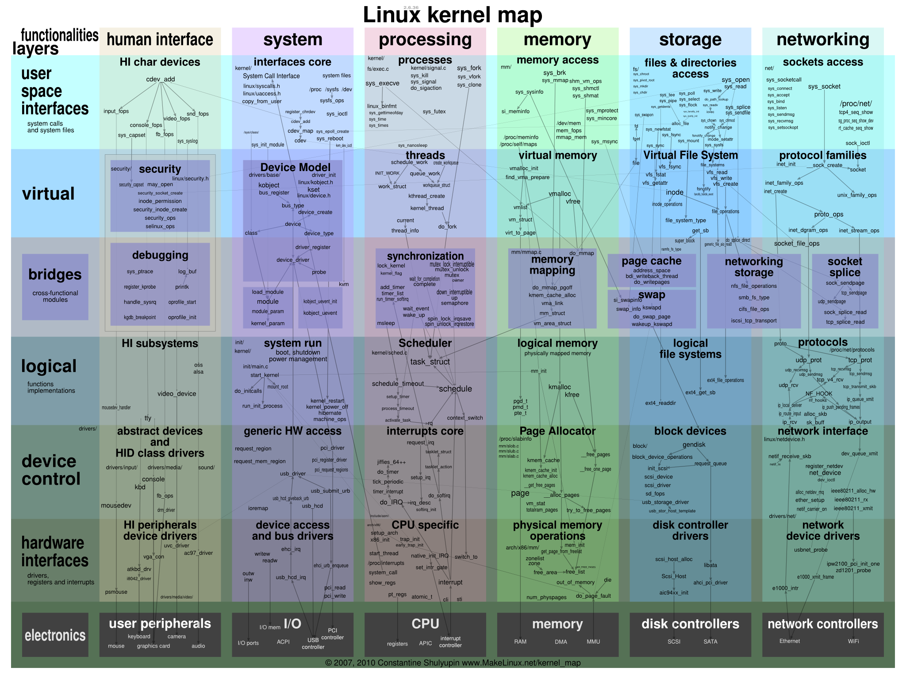

linux全局图

[链接](https://www.jianshu.com/p/6e346c824c43)

[简书](https://www.jianshu.com/p/24847f24ffbb)

# 1 Linux下进程通信

Linux下进程通信有以下七种：

- 1、匿名管道(pipe)
- 2、命名管道(FIFO)
- 3、信号(signal)
- 4、信号量(semaphore)
- 5、消息队列(message queue)
- 6、共享内存(share memory)
- 7、套接字(Socket)

