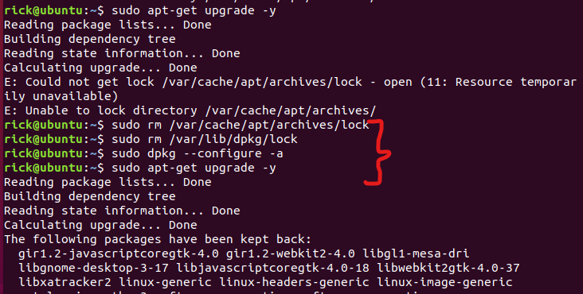

# 问题：E: Could not get lock /var/lib/dpkg/lock – open (11: Resource temporarily unavailable)

E: Could not get lock /var/lib/dpkg/lock - open (11: Resource temporarily unavailable)
E: Unable to lock the administration directory (/var/lib/dpkg/), is another process using it?

 #  解决

因为有另外一个程序在运行，导致锁不可用。原因可能是上次运行更新或安装没有正常完成。解决办法是杀死此进程
sudo rm /var/cache/apt/archives/lock
sudo rm /var/lib/dpkg/lock

sudo dpkg --configure -a

sudo apt-get update